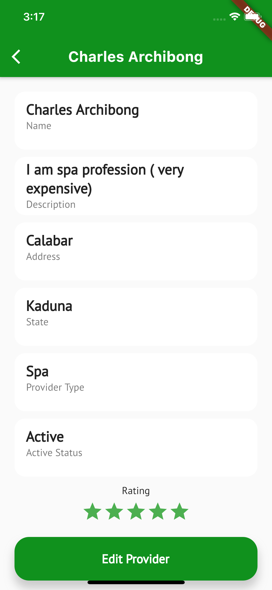

# prozone_app

ProZone is a provider aggregator company, that has a large network of healthcare providers (Gym, Spas, Optical Centres, Hospitals etc.) that they work with.

They have provider officers that are responsible for signing up and managing these providers.
Build a simple mobile application that will be used by a provider officer for managing providers that are currently in their network.

# Simple UIs

## Built by
- [Charles Archibong](https://www.linkedin.com/in/charles-archibong)

